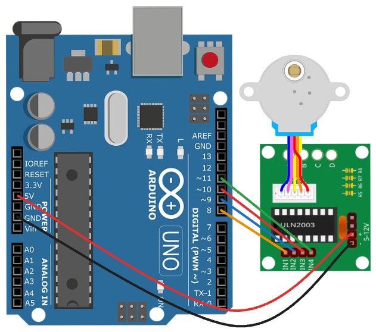

# CPUMoStepper

Refurbishing an old pressure clock and integrating a stepper motor, which will be controlled based on the CPU usage

### Components used:
* Aduino Uno
* ULN2003 Motor Controller
* 28BYJ-48 Stepper Motor 5v
* Old Pressure Clock

## Instructions

1. Start the Aduino and write the stepper program stepper.ino
2. Set com port in calibrate_clock.py and start it to calibrate the the motor
    1. right arrowkey 1 degree clockwise and left 1 degree counterclockwise
    2. up arrowkey 10 degree clockwise and down 10 degree counterclockwise
    3. enter key for custom value
3. Set numbers of degree on the clock and com port in get_cpu_usage.py file
4. Start the program with get_cpu_usage.py

## Diagram

